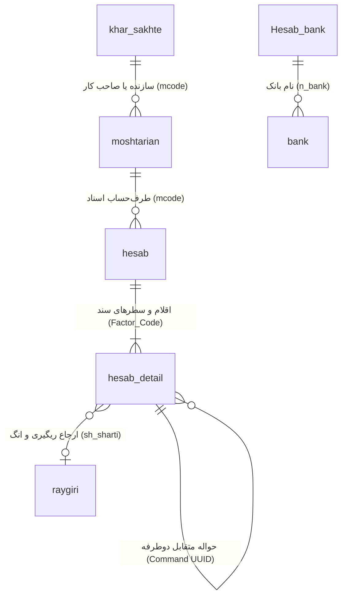

# راهنمای جامع و مستندات مهندسی معکوس مهاجرت از ته‌حساب به زرفولیو (Tahesab to Zarfolio Migration)

این سند مرجع فنی و جامع تحلیل ساختار، مهندسی معکوس کانتینر، طراحی معماری، نقشه‌برداری داده‌ها (Mapping)، قوانین اعتبارسنجی و استراتژی اجرای مهاجرت از سامانه حسابداری ته‌حساب (Tahesab) به نرم‌افزار زرفولیو (Zarfolio) است.

---

## ۱. ساختار فایل Backup (.Mcbk)

### ۱.۱. مشخصات کانتینر
فایل‌های پشتیبان ته‌حساب با پسوند `.Mcbk` (مخفف احتمالی Multi-Container Backup) توزیع می‌شوند. مهندسی معکوس بایت‌های هدر و جریان‌های داده این فایل نشان داد که این فرمت یک کانتینر باینری آرشیو سفارشی مبتنی بر فشرده‌سازی استاندارد Zlib/Deflate است.

- **Magic Header / Version**: ۴ بایت ابتدایی فایل عدد صحیح بدون علامت (Little-Endian) با مقدار `0x0000000F` (نسخه آرشیو: ۱۵) می‌باشد.
- **توالی آیتم‌ها (Archive Entries)**: پس از هدر ۴ بایتی، بلوک‌های فایل به صورت متوالی تا انتهای فایل ذخیره شده‌اند:
  ```
  ┌─────────────────────────────────────────────────────────────┐
  │ Name Length (uint32 Little-Endian)                          │ 4 bytes
  ├─────────────────────────────────────────────────────────────┤
  │ Entry Name (ASCII / Latin1 string)                          │ N bytes
  ├─────────────────────────────────────────────────────────────┤
  │ Uncompressed Size (uint32 Little-Endian)                    │ 4 bytes
  ├─────────────────────────────────────────────────────────────┤
  │ Zlib Compressed Data Stream (deflate RFC 1951 / RFC 1950)   │ Variable
  └─────────────────────────────────────────────────────────────┘
  ```
- **تشخیص پایان بلوک فشرده**: هر ورودی با یک شیء استریم Zlib فشرده شده و داده‌های باقی‌مانده استریم بعدی با اتمام جریان فشرده‌سازی Zlib به صورت خودکار تفکیک می‌شوند.

### ۱.۲. تحلیل موجودیت‌های استخراج‌شده از فایل Fixture
تحلیل فایل اصلی `1.mcbk` (حجم: ۱۱,۲۳۷,۸۰۹ بایت) نشان داد که این کانتینر شامل ۱۵ فایل داخلی به شرح زیر است:

| ردیف | نام فایل داخلی | حجم فشرده (بایت) | حجم غیرفشرده (بایت) | نوع محتوا و توضیحات |
| :---: | :--- | :---: | :---: | :--- |
| ۱ | `xDB.SQL` | ۳۴۷,۱۵۲ | ۴,۹۸۳,۲۵۸ | اسکریپت SQL ثبت وقایع روزانه و پیامک‌ها (`Daftare_Roozaneh`) |
| ۲ | `BkUp1.Mbk` | ۴,۳۳۰,۱۶۳ | ۱۱۱,۹۵۸,۴۶۶ | **پایگاه داده اصلی مالی** (اسکریپت SQL Server با ۲۴ جدول) فشرده با Zlib |
| ۳ | `backUp.Info` | ۱۳۴ | ۱۶۶ | فایل متنی INI شامل متادیتای تاریخ، تعداد محیط‌ها و نسخه‌ها |
| ۴ | `Mohit1.Mbk` | ۳,۵۶۹ | ۲۵,۳۰۰ | تنظیمات و پایگاه داده محیط کاری ۱ |
| ۵ | `xDB1.SQL` | ۵۸۲ | ۱,۳۵۲ | اسناد تکمیلی محیط ۱ |
| ۶ | `Mohit2.Mbk` | ۴,۶۸۷ | ۳۵,۳۷۹ | تنظیمات و پایگاه داده محیط کاری ۲ |
| ۷ | `xDB2.SQL` | ۵۸۹ | ۱,۳۷۱ | اسناد تکمیلی محیط ۲ |
| ۸ | `ArchiveDB1.Mcbk` | ۹۹۶,۴۳۴ | ۲۴,۲۰۵,۶۶۰ | پایگاه داده آرشیو دوره مالی ۱ (Zlib فشرده) |
| ۹ | `ArchiveDB2.Mcbk` | ۱,۶۶۵,۵۵۸ | ۴۱,۱۶۰,۶۷۷ | پایگاه داده آرشیو دوره مالی ۲ (Zlib فشرده) |
| ۱۰ | `ArchiveDB3.Mcbk` | ۱,۸۵۸,۸۹۸ | ۴۷,۷۷۸,۸۸۳ | پایگاه داده آرشیو دوره مالی ۳ (Zlib فشرده) |
| ۱۱ | `ArchiveDB4.Mcbk` | ۲,۰۲۰,۸۰۹ | ۵۴,۳۱۴,۹۴۶ | پایگاه داده آرشیو دوره مالی ۴ (Zlib فشرده) |
| ۱۲ | `Mconfig.db` | ۷۳۲ | ۲,۰۱۸ | تنظیمات سرور، کاربر Admin و گزارشات خلاصه |
| ۱۳ | `Factor.Tff` | ۴,۲۲۴ | ۳۱,۱۷۷ | قالب چاپ فاکتور نرم‌افزار FastReport XML |
| ۱۴ | `Etiket.Tff` | ۱,۴۲۳ | ۵,۶۴۹ | قالب چاپ برچسب / اتیکت FastReport XML |
| ۱۵ | `Certificate.Tff` | ۲,۵۶۳ | ۱۷,۳۹۶ | قالب چاپ شناسنامه سنگ و جواهر FastReport XML |

### ۱.۳. متادیتای سیستم (backUp.Info)
محتوای فایل `backUp.Info`:
```ini
[BackupInfo]
Info.Date=1405/06/26
MohitCount=2
DB-TYPE=SQL
Version=10.1405.4.20
ArchiveCount=4
MConfig=1
Mgold.db.FDate=1402/04/03
Mgold.db.TDate=1405/06/26
```
- **نوع دیتابیس پایه‌ای**: SQL Server (تولیدشده توسط کامپوننت دلفی UniDAC نسخه 12.0.1 برای SQL Server 16.00).
- **بازه زمانی فعال پشتیبان**: از `1402/04/03` تا `1405/06/26` (مطابق با ۲۴ ژوئن ۲۰۲۳ تا ۱۷ سپتامبر ۲۰۲۶ میلادی).
- **کدگذاری متون فارسی (Encoding)**: فرمت خروجی اسکریپت‌ها استاندارد Windows-1256 (CP1256) به همراه متون با پیشوند یونیکد `N'...'` می‌باشد.

---

## ۲. جدول‌های شناسایی‌شده در دیتابیس اصلی (BkUp1.Mbk)

در فایل اصلی `BkUp1.Mbk` تعداد ۲۴ جدول با ساختار زیر شناسایی و استخراج شدند:

| نام جدول | تعداد رکوردها | نقش در سیستم ته‌حساب |
| :--- | :---: | :--- |
| `hesab_detail` | ۵۰,۲۳۷ | ردیف‌های اسناد مالی، طلا، نقره، حواله‌ها، ریگیری و نقدی |
| `hesab` | ۲۶,۰۷۵ | سربرگ اسناد حسابداری، فاکتورها، جمع اوزان و مبالغ و تاریخ‌ها |
| `khar_sakhte` | ۲۶,۰۵۲ | کالاهای ساخته‌شده، کارهای جور، اجرت‌ها، وزن و موجودی |
| `moshtarian` | ۵۹۰ | اشخاص و طرف‌حساب‌ها (۲۷۶ مشتری فعال با نام و اطلاعات کامل) |
| `raygiri` | ۳۰۵ | آزمایشگاه‌ها و مراکز ریگیری ثبت‌شده در سیستم |
| `Etiket_Manual` | ۲۱۵ | رکوردهای دستی چاپ اتیکت و بارکد کالا |
| `Kar_Sakhte_SabtSang` | ۶۷ | جزئیات سوار کردن سنگ روی کارهای ساخته‌شده |
| `Sang` | ۴۹ | کاتالوگ سنگ‌ها و جواهرات قیمتی و نیمه‌قیمتی |
| `Cities` | ۳۰ | جدول شهرهای ایران برای نشانی مشتریان |
| `Hazine_Baabat` | ۲۱ | سرفصل‌ها و بابت‌های هزینه‌ها |
| `Factor_Rec` | ۱۹ | انواع و الگوهای فاکتور |
| `bank` | ۱۸ | لیست بانک‌های کشور |
| `gorooh` | ۱۶ | گروه‌بندی طرف‌حساب‌ها و مشتریان |
| `Sekeh_Shemsh` | ۱۱ | انواع مسکوکات طلا (بهار، امامی، نیم، ربع، گرمی) و شمش‌ها |
| `Hesab_bank` | ۶ | حساب‌های بانکی تعریف‌شده به همراه موجودی اولیه |
| `R_Gorooh` | ۶ | جمع‌های آماری و گزارشات گروه‌ها |
| `J_FighSang` | ۵ | فی پایه‌ای سنگ‌ها |
| `J_MorFiSang` | ۵ | ضرایب ریالی قیمت‌گذاری سنگ |
| `R_No` | ۲ | دسته‌بندی کارمزد و کارهای تعمیری |
| `KALA` | ۱ | اقلام کالا متفرقه |
| `PhoneBook` | ۱ | دفترچه تلفن تکمیلی |
| `R_KarMand` | ۱ | اطلاعات کارمندان و پرسنل |
| `Sanad_Multi` | ۱ | اسناد چندگانه متفرقه |
| `TahesabCustomerInfo` | ۱ | اطلاعات شناسنامه‌ای مالک سیستم و کارگاه |

همچنین در فایل `xDB.SQL`:
- `Daftare_Roozaneh`: ۸,۵۲۹ رکورد لاگ روزانه، ثبت اسناد، نام طرف و تاریخ‌ها.

---

## ۳. ستون‌ها و فیلدهای کلیدی

### ۳.۱. طرف‌حساب‌ها (`moshtarian`)
- `code`: کد یکتای مشتری در ته‌حساب (کد عددی)
- `name`: نام و نام خانوادگی / نام تجاری طرف‌حساب
- `Tel`, `Tel2`, `Tel3`, `Tel4`: شماره تلفن‌های تماس و موبایل
- `add`: آدرس محل کسب / سکونت
- `City`: شهر
- `PostalCode`: کد پستی
- `gorooh`, `GID`: کد و نام گروه مشتری
- `tahesabtala`: موجودی اولیه یا ثبت‌شده طلا
- `tahesabriali`: موجودی اولیه یا ثبت‌شده ریالی
- `JamV_T`, `JamV_P`: گردش‌های انباشته طلایی و پولی
- `Arz`, `Arz2`: واحد ارزی مبنا (IRR, USD)

### ۳.۲. سربرگ اسناد (`hesab`)
- `Factor_Code`: شناسه یکتای سند در ته‌حساب (Primary Key)
- `mcode`: کد طرف‌حساب مربوطه (Foreign Key به `moshtarian.code`)
- `sh_factor`: شماره فاکتور / شماره سند صادره
- `Tarikh`: تاریخ و زمان ثبت سند (Gregorian ISO String: `YYYY-MM-DD HH:MM:SS.mmm`)
- `geram_v`: جمع وزن طلای وارده در سند (گرم)
- `geram_kh`: جمع وزن طلای صادره در سند (گرم)
- `rial_v`: جمع مبلغ ریالی دریافتی در سند (ریال)
- `rial_kh`: جمع مبلغ ریالی پرداختی در سند (ریال)
- `tahesab_T`: مانده حساب طلایی پس از این سند
- `tahesab_P`: مانده حساب ریالی پس از این سند
- `Jens_Felez`: نوع فلز (`0`: طلا، `2`: نقره)
- `Arz`: ارز معامله (`IRR`, `USD`)

### ۳.۳. ردیف‌های اسناد (`hesab_detail`)
- `Factor_Code`: شناسه سند مادر (FK به `hesab.Factor_Code`)
- `no`: شماره ردیف در سند (Sequence)
- `vazn`: وزن فیزیکی طلا یا فلز (گرم با ۳ رقم اعشار)
- `ayar`: عیار وزنی معامله (مانند ۷۵۰، ۹۹۵، ۷۴۹، ۷۴۷ و ...)
- `tabdil750_v`: وزن تبدیل‌شده به عیار مبنای ۷۵۰ برای ورود
- `tabdil750_kh`: وزن تبدیل‌شده به عیار مبنای ۷۵۰ برای خروج
- `sh_sharti`: شماره رسید / قبض ریگیری یا شماره انگ آبشده شرطی (در ۳,۰۴۱ رکورد)
- `Abshode`: پرچم آبشده بودن قطعه طلا (`-1` معادل True در دلفی، در ۳,۱۴۶ رکورد)
- `Command`: نوع دستور عملیاتی. این فیلد شامل توکن‌های ردگیری حواله‌های متقابل است:
  - `#HAVALEH#<UUID>#<Seq>`: طرف فرستنده حواله
  - `#hshbe#<UUID>#<Seq>`: طرف گیرنده حواله (حواله به)
- `name_az`: عنوان یا نام طرف انتقال در حواله
- `Sharh`: شرح ردیف سند و توضیحات کاربری
- `rial_V`: مبلغ ریالی ورودی
- `rial_kh`: مبلغ ریالی خروجی
- `FI`: قیمت واحد یا مظنه طلا
- `FiF`: قیمت فروش
- `Count`: تعداد (برای سکه یا اقلام تعدادی)
- `NO_kar`: نوع کار و طبقه‌بندی قلم (مانند انگشتر، دستبند، رزین، نسابیده و ...)
- `Jens_Felez`: فلز (`0` = طلا، `2` = نقره)
- `Arz`: شناسه ارز در اسناد ارزی (`USD`)

### ۳.۴. حساب‌های بانکی (`Hesab_bank`)
- `Sh_Hesab`: شماره حساب بانکی
- `n_bank`: نام بانک عامل (ملت، سپه، کشاورزی، مسکن، اقتصاد نوین و ...)
- `MojoodiA`: موجودی اولیه ریالی افتتاح حساب
- `MoJoodi`: مانده جاری ریالی در ته‌حساب
- `tarikh_Eftetah`: تاریخ افتتاح حساب

---

## ۴. روابط داده‌ای (Entity Relationships)



1. **ارتباط ۱ به چند `hesab` و `hesab_detail`**: از مجموع ۵۰,۲۳۷ ردیف موجود در `hesab_detail`، تعداد ۵۰,۲۳۵ ردیف (۹۹.۹۹۶٪) دارای `Factor_Code` متناظر معتبر در جدول `hesab` هستند.
2. **ارتباط جفت‌های حواله (Transfers Linkage)**: در ردیف‌های حواله، ته‌حساب از یک شناسه اشتراکی استفاده می‌کند:
   - سطر اول: `#HAVALEH#<UID>#<ID>` (حواله از / بدهکار/خروج)
   - سطر دوم: `#hshbe#<UID>#<ID>` (حواله به / بستانکار/ورود)
   تعداد ۶,۰۵۹ ردیف `HAVALEH` با ۶,۰۵۸ ردیف `hshbe` در دیتابیس وجود دارد که تطابق تقریباً ۱۰۰٪ دارند.

---

## ۵. عملیات قابل استخراج

بر اساس بررسی رکوردهای واقعی، عملیات زیر قابلیت استخراج و تبدیل به ساختار دامنه‌ای زرفولیو را دارند:

1. **طرف‌حساب‌ها و اشخاص (Customers / Parties)**:
   - اطلاعات هویتی، نام کامل، شماره تماس‌ها، نشانی، شهر، گروه کاربری و ارز پیش‌فرض.
2. **اسناد طلای خام و آبشده (Raw Gold & Melted Gold)**:
   - ورود طلای متفرقه / ضایعات با عیار دلخواه
   - خروج طلای آبشده با انگ و وزن
   - تبدیل دقیق عیار به عیار مبنای ۱۸ (۷۵۰) با فرمت: `وزن * عیار / ۷۵۰`
3. **طلای شرطی (Conditional Gold)**:
   - ۳,۰۴۱ رکورد دارای شماره رسید و قبض ریگیری در فیلد `sh_sharti`
   - نگهداری وزن، عیار اولیه و شماره انگ جهت تعیین عیار نهایی
4. **حوالجات فلزی و ریالی (Metal & Cash Transfers)**:
   - شناسایی پیوند دوطرفه مبدأ و مقصد حواله با استفاده از توکن یکتای `Command`
   - ایجاد اسناد متناظر حواله با حفظ شماره ارجاع دوطرفه
5. **اسناد و مانده‌های نقدی و ریالی (Cash & Rial Transactions)**:
   - مبالغ دریافتی و پرداختی مشتریان به صورت عدد صحیح ریال (`IRR`)
6. **اسناد ارزی (USD Foreign Currency)**:
   - ۲,۳۹۷ رکورد با ارز دلار (`USD`) در سطور اسناد
7. **حساب‌های بانکی و موجودی‌های اولیه (Bank Accounts & Opening Balances)**:
   - ۶ حساب بانکی فعال به همراه مانده‌های اولیه
8. **انواع مسکوکات و شمش‌ها (Coins & Bullions)**:
   - ۱۱ نوع سکه و شمش با وزن و عیار استاندارد
9. **سنگ‌ها و جواهرات (Gemstones)**:
   - ۴۹ نوع سنگ با نام‌های فارسی و لاتین جهت تغذیه کاتالوگ سنگ‌ها در زرفولیو

---

## ۶. نقشه‌برداری داده‌ها (Mapping: Tahesab → Zarfolio)

### ۶.۱. طرف‌حساب‌ها
| فیلد ته‌حساب | فیلد زرفولیو (`customers`) | تبدیل و منطق |
| :--- | :--- | :--- |
| `moshtarian.code` | `customerCode` / متادیتای منبع | نگهداری کد ته‌حساب در متادیتا جهت Traceability |
| `moshtarian.name` | `name` | متن تمیزشده فارسی با یکسان‌سازی ی/ک |
| `moshtarian.Tel` | `phone1` | نرمال‌سازی شماره همراه و ارقام فارسی |
| `moshtarian.Tel2` | `phone2` | نرمال‌سازی شماره تماس ثانویه |
| `moshtarian.add` | `address1` | نشانی پستی |
| `moshtarian.City` | `city` | انطباق با جدول شهرهای ایران |
| `moshtarian.gorooh` | `groupName` | تطبیق یا ایجاد گروه در `customer_groups` |
| `moshtarian.Arz` | `primaryCurrency` | تبدیل `USD` یا پیش‌فرض `IRR` |

### ۶.۲. سربرگ و سطرهای اسناد
| فیلد ته‌حساب | فیلد زرفولیو (`transactions`) | منطق و تبصره |
| :--- | :--- | :--- |
| `hesab.Factor_Code` | `documentDetails.sourceTahesabFactorCode` | ردگیری کامل مبدأ |
| `hesab.sh_factor` | `documentNumber` / `documentSequence` | حفظ شماره فاکتور اصلی در پیش‌نمایش |
| `hesab.Tarikh` | `transactionDate` & `documentDateJalali` | تبدیل تایم‌استمپ میلادی به تاریخ دقیق شمسی |
| `mcode` | `customerId` | از طریق جدول Mapping طرف‌حساب‌ها |
| `vazn`, `tabdil750_v` | `goldAmount` (مثبت برای ورود) | وزن بر مبنای عیار ۷۵۰ |
| `vazn`, `tabdil750_kh` | `goldAmount` (منفی برای خروج) | وزن بر مبنای عیار ۷۵۰ |
| `rial_V` | `rialAmount` (دریافت) | ذخیره به عنوان عدد صحیح ریال (`IRR`) |
| `rial_kh` | `rialAmount` (پرداخت) | ذخیره به عنوان عدد صحیح ریال (`IRR`) |
| `Arz = 'USD'` | `foreignAmount` & `foreignCurrency` | ذخیره مقدار ارزی دلار در فیلد اختصاصی |
| `sh_sharti` | `documentDetails.assayStampNumber` | شماره قبض ریگیری / انگ |
| `Command` (حواله) | `documentTab = 'our-claim'` / `general` | ثبت ارجاع دوسویه با شناسه `transferRef` |

### ۶.۳. قاعده تبدیل عیار طلا
تحلیل آماری ۴۴,۱۳۶ سطر نشان داد فرمت تبدیل استاندارد طلا به عیار ۷۵۰ به صورت زیر است:
$$\text{Converted Weight (750)} = \text{round}\left(\frac{\text{vazn} \times \text{ayar}}{750}, 3\right)$$
در مواردی که کارهای ساخته‌شده دارای اجرت درصدی (`Darsad`) یا کارمزد طلایی هستند، مقدار تبدیل شامل وزن پایه به‌علاوه درصد اجرت اضافه شده به طلای معادل می‌باشد.

---

## ۷. محدودیت‌های Backup

۱. **عدم وجود رکوردهای چک**: علی‌رغم وجود ساختار فیلدهای چک در جدول `hesab_detail` (`sh_check`, `name_bank`, `tarikh_check`)، در دیتابیس فعال این پشتیبان هیچ چکی با مشخصات کامل ثبت نشده است.
۲. **نبود تراکنش‌های پلاتین**: فیلد `Jens_Felez` منحصراً شامل کدهای ۰ (طلا) و ۲ (نقره) بوده و تراکنش پلاتین در این فایل وجود ندارد.
۳. **تخت بودن ساختار حساب‌ها در ته‌حساب**: ته‌حساب فاقد ساختار درختی چندسطحی استاندارد (کل، معین، تفصیلی) است؛ در نتیجه پیوند به دفتر کل زرفولیو نیاز به نگاشت صریح دارد.
۴. **تراکنش‌های بدون سرفصل صریح**: برخی اسناد صرفاً بابت‌های متنی دارند که نیاز به تعیین حساب متناظر در لایه Mapping دارد.

---

## ۸. موارد پشتیبانی‌نشده (Unsupported Items)

موارد زیر مستقیماً به سند مالی تبدیل نمی‌شوند بلکه در صورت نیاز در فرمت متادیتای خام جهت مراجعات بعدی بایگانی می‌گردند:
- **فایل‌های قالب FastReport (`*.Tff`)**: این فایل‌ها باینری‌های گزارش‌ساز دلفی هستند و در زرفولیو که از سیستم چاپ مبتنی بر React استفاده می‌کند، قابل رندر نیستند.
- **اطلاعات حساب کاربری ته‌حساب (`Admin`)**: کلمه عبور با هش اختصاصی نگهداری شده و کاربران زرفولیو باید از احراز هویت داخلی PB استفاده کنند.
- **لاگ‌های پیامکی دفتر روزانه (`Daftare_Roozaneh.SMSText`)**: تنها به عنوان رویدادهای بازرسی ثبت می‌شوند و نباید به عنوان سند مالی درج گردند.

---

## ۹. معماری پیشنهادی ماژول مهاجرت

معماری ماژول باید یک خط لوله داده‌ای (Pipeline) ماژولار و مستقل باشد که بدون دور زدن موتور حسابداری زرفولیو کار کند:

```
┌─────────────────────────┐
│     Tahesab Backup      │ (.Mcbk Archive)
└────────────┬────────────┘
             │
             ▼
┌─────────────────────────┐
│     Tahesab Detector    │ (تشخیص هدر، نسخه و صحت Zlib)
└────────────┬────────────┘
             │
             ▼
┌─────────────────────────┐
│      Tahesab Parser     │ (استخراج استریم، جداسازی فایل‌ها و پارس خطی SQL)
└────────────┬────────────┘
             │
             ▼
┌─────────────────────────┐
│    Tahesab Raw Model    │ (مدل‌سازی بومی جدول‌های ته‌حساب)
└────────────┬────────────┘
             │
             ▼
┌─────────────────────────┐
│ Normalized Migration    │ (مدل استاندارد میانی بدون وابستگی به زرفولیو)
└────────────┬────────────┘
             │
             ▼
┌─────────────────────────┐
│      Mapping Layer      │ (نگاشت حساب‌ها، اشخاص، فلزات و ارزها)
└────────────┬────────────┘
             │
             ▼
┌─────────────────────────┐
│     Validation Layer    │ (اعتبارسنجی تراز، یکپارچگی ارجاعات و عدم تکرار)
└────────────┬────────────┘
             │
             ▼
┌─────────────────────────┐
│  Zarfolio Domain Adap.  │ (ایجاد ورودی‌های دامنه‌ای زرفولیو)
└────────────┬────────────┘
             │
             ▼
┌─────────────────────────┐
│ Zarfolio Account Engine │ (Posting Engine & Document Service)
└────────────┬────────────┘
             │
             ▼
┌─────────────────────────┐
│  Documents & Journals   │ (ثبت نهایی در Transactions و Journal Lines)
└─────────────────────────┘
```

---

## ۱۰. قوانین اعتبارسنجی (Validation Rules)

### ۱۰.۱. اعتبارسنجی فایل (File Validation)
- فایل باید با هدر `0x0000000F` شروع شود.
- بخش `BkUp1.Mbk` و `backUp.Info` باید بدون خطای CRC/Decompress اکسترکت شوند.
- متادیتای تاریخ باید فرمت معتبر جلالی داشته باشد.

### ۱۰.۲. اعتبارسنجی مقادیر (Data Validation)
- **وزن (Weight)**: اوزان باید مثبت، محدود به حداکثر ۶ رقم صحیح و ۳ رقم اعشار باشند.
- **عیار (Grade)**: عیار باید عددی بین ۱ تا ۱۰۰۰ باشد (مانند ۷۵۰ برای ۱۸ عیار).
- **مبالغ (Amount)**: مبالغ ریالی باید اعداد صحیح بزرگ‌تر یا مساوی صفر به عنوان ریال باشند.
- **تاریخ (Date)**: تاریخ‌ها باید در بازه معتبر بین ۱۳۷۰ تا ۱۵۰۰ شمسی قرار گیرند.

### ۱۰.۳. اعتبارسنجی حسابداری (Accounting Validation)
- هر سند واردشده به موتور حسابداری باید تراز باشد (مجموع بدهکار = مجموع بستانکار).
- هر ردیف فلزی باید دارای مانده مشخص یا طرف‌حساب معتبر باشد.
- اسناد حواله باید در صورت داشتن طرف متقابل، هر دو سمت را متناظر ثبت کنند.

---

## ۱۱. استراتژی جلوگیری از تکرار (Duplicate Strategy & Idempotency)

برای تضمین این که اجرای چندباره Import هیچ داده یا سندی را دوباره نسازد:
۱. **کلید یکتای منبع (`sourceKey`)**:
   برای هر سند و ردیف، یک کلید قطعی تولید می‌شود:
   `sourceKey = tahesab:<migrationId>:<factorCode>:<lineNumber>`
۲. **بررسی سابقه مهاجرت**: قبل از ایجاد هر مشتری یا سند، وجود کلید در کالکشن `transactions` و کالکشن ردیابی مهاجرت بررسی می‌شود. در صورت وجود، عملیات Skip شده و پرچم `alreadyImported` برگردانده می‌شود.
۳. **تطبیق اشخاص بر پایه کد و نام**: اگر مشتری با همان نام یا کد قبلاً در سیستم ثبت شده باشد، سوابق جدید به همان شناسه لینک می‌شوند تا از ایجاد مشتریان تکراری جلوگیری شود.

---

## ۱۲. استراتژی بازگشت به عقب (Rollback Strategy)

هر عملیات مهاجرت یک شناسه یکتا به عنوان `migrationId` دریافت می‌کند (مانند `mig_14050626_xxxx`).
- تمامی رکوردهای ایجادشده در `transactions`, `journal_entries`, `pbc_journal_lines`, `customers`, `bank_accounts` دارای برچسب `migrationId` خواهند بود.
- در زمان اجرای **Rollback**:
  ۱. تمامی اسناد و تراکنش‌های ساخته‌شده با این شناسه حذف یا باطل می‌شوند.
  ۲. اسناد و داده‌هایی که قبل از این مهاجرت در سیستم وجود داشته‌اند به هیچ وجه دست‌نخورده باقی می‌مانند.
  ۳. جداول لاگ عملیات مهاجرت، وضعیت را به `rolled_back` تغییر می‌دهند.

---

## ۱۳. الزامات امنیتی (Security)

۱. **حفاظت از فایل نسخه پشتیبان**: فایل‌های `.Mcbk` هرگز نباید در مخزن گیت کامیت یا به اشتراک گذاشته شوند (تنظیم قطعی در `.gitignore`).
۲. **عدم افشای اطلاعات مالی در لاگ‌ها**: اسامی اشخاص، شماره تماس‌ها، مبالغ ریالی و اوزان طلا در هیچ لاگ کنسول یا پیام خطایی چاپ نخواهند شد.
۳. **کنترل دسترسی**: دسترسی به ماژول مهاجرت منحصراً محدود به کاربران دارای نقش مدیر ارشد (`system_admin` / پرمیشن `settings.manage`) می‌باشد.

---

## ۱۴. کارایی و مقیاس‌پذیری (Performance)

۱. **پردازش جریانی (Streaming & Chunking)**: دیتابیس `BkUp1.Mbk` با حجم غیرفشرده بیش از ۱۱۰ مگابایت به صورت استریم و چانک‌های ۱ مگابایتی پردازش شده و کل داده در حافظه RAM کپی نمی‌شود.
۲. **عملیات دسته‌ای (Batching)**: ایجاد اسناد و اشخاص در دسته‌های ۱۰۰ تا ۵۰۰ تایی انجام می‌پذیرد تا از بلاک شدن دیتابیس یا انقضای حافظه جلوگیری شود.

---

## ۱۵. استراتژی تست (Test Strategy)

تست‌های ماژول مهاجرت بر روی داده‌های واقعی فایل `1.mcbk` پیاده‌سازی می‌شوند:
۱. تست شناسایی فرمت و اکسترکت فایل کانتینر (`detector.test.ts`)
۲. تست پارسر و استخراج اسکریپت‌های SQL ته‌حساب (`parser.test.ts`)
۳. تست نرمال‌سازی و اعتبارسنجی فرمول تبدیل عیار طلا (`normalizer.test.ts`)
۴. تست جفت‌سازی حواله‌ها (`transfer-mapping.test.ts`)
۵. تست پیش‌نمایش و اعتبارسنجی تراز (`preview.test.ts`)
۶. تست عدم تکرار (Idempotency) در ایمپورت مکرر (`idempotency.test.ts`)
۷. تست بازگشت‌پذیری (Rollback) کامل اطلاعات ثبت‌شده (`rollback.test.ts`)
